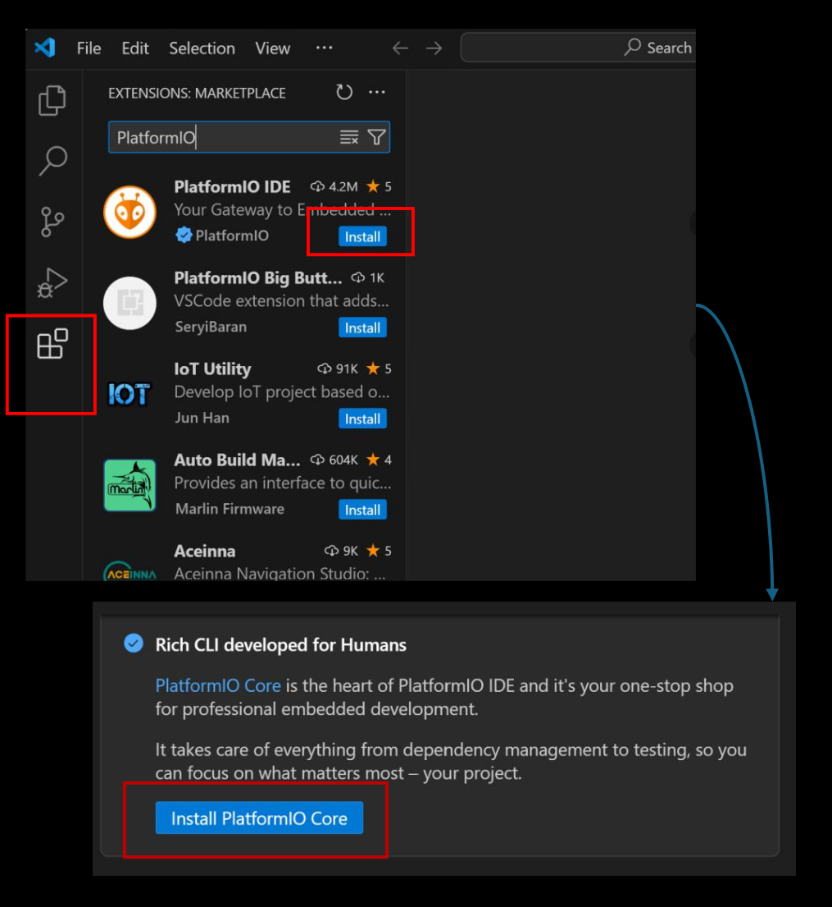
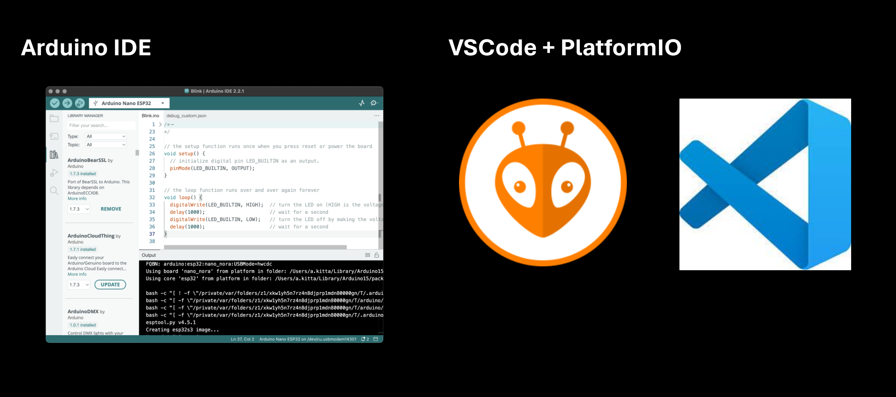
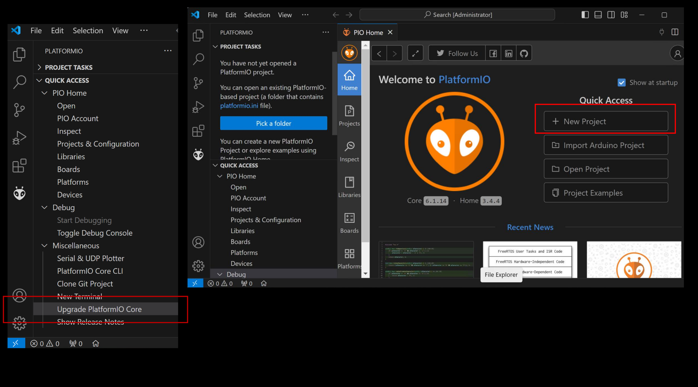
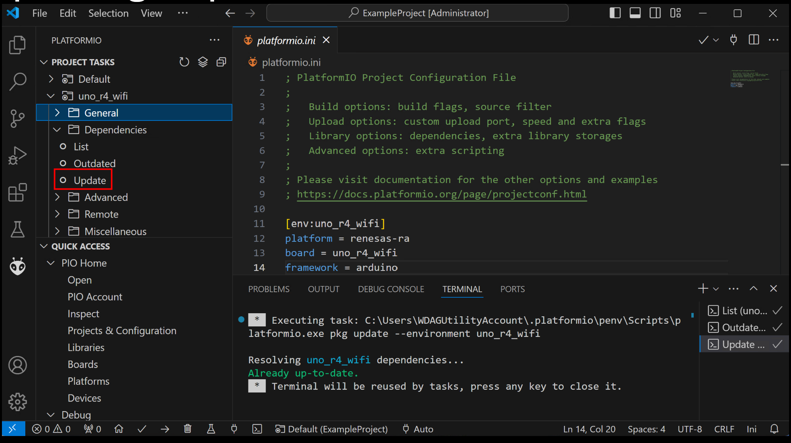
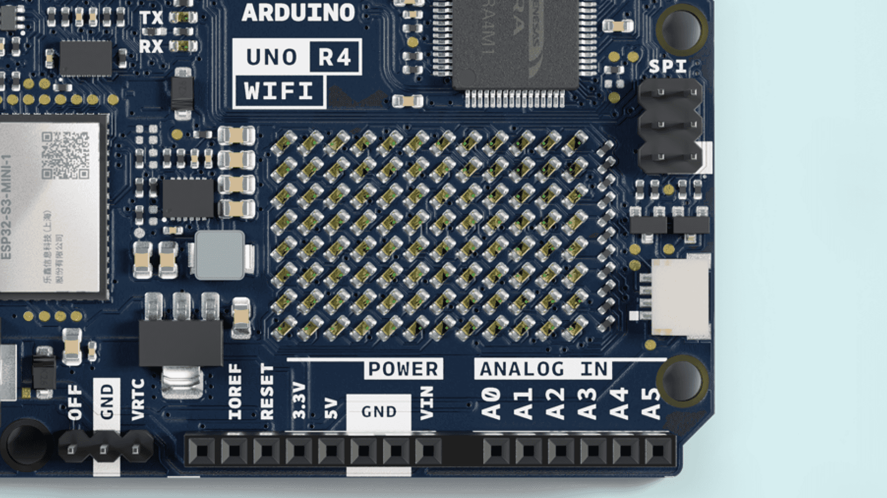
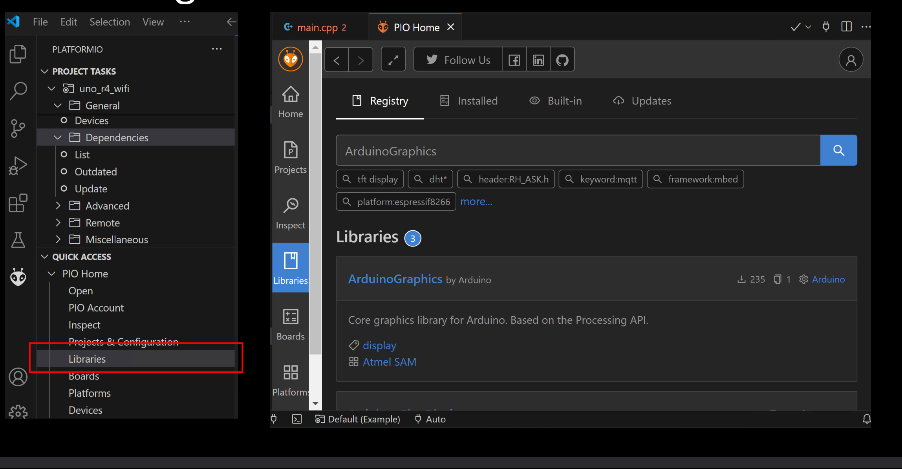
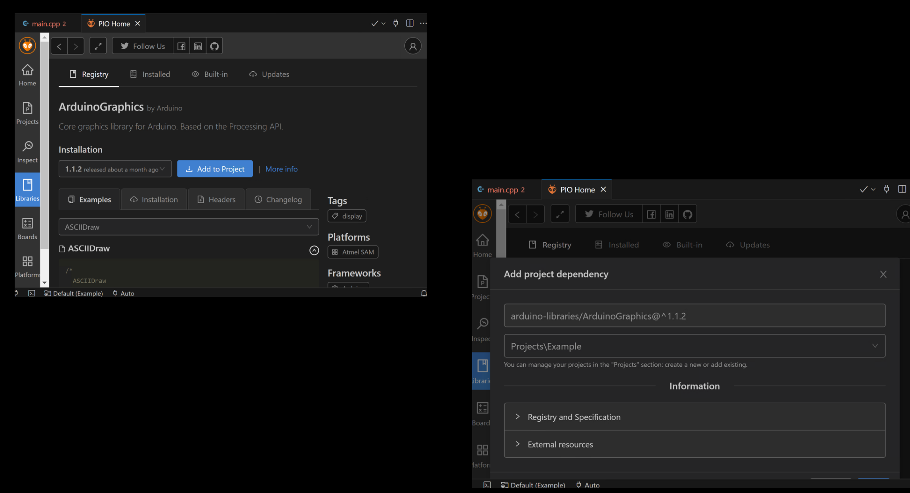

# Programming the Arduino Uno R4 Matrix Display

UB IEEE x DREAM

Please join our Discord:


---

## Installing VSCode

Visual Studio Code is a powerful text editor. VS Code's powerful and popular extension ecosystem can give it many of the powers of a fully-fledged IDE. You can download Visual Studio Code from here: https://code.visualstudio.com/download.


---

## Installing PlatformIO

Install PlatformIO as a VSCode extension:


--

## Comparison of Arduino IDE vs. VSCode + PlatformIO



---

## Creating a New Project



---

## Differences Between Arduino IDE's `.ino` and Using Arduino Framework Directly

---

## Arduino Software Convention

- The Arduino IDE uses `.ino` files
- Arduino is really just C++
- PlatformIO is how it really is

Arduino main:

```cpp
int main(void){
    init();
    setup();
    while (true){
        loop();
    }
    return 0;
}
```

---

## The `platformio.ini` Configuration File

```.ini
[env:uno_r4_wifi]
platform = renesas-ra
board = uno_r4_wifi
framework = arduino
```

---

## Updating Dependencies



---

## Blink - the `Hello, World!` of Hardware

```cpp
#include <Arduino.h>

// put function declarations here:
int myFunction(int, int);

void setup() {
  // put your setup code here, to run once:
  int result = myFunction(2, 3);
}

void loop() {
  // put your main code here, to run repeatedly:
  digitalWrite(LED_BUILTIN, HIGH);
  delay(1000);
  digitalWrite(LED_BUILTIN, LOW);
  delay(1000);
}

// put function definitions here:
int myFunction(int x, int y) {
  return x + y;
}
```

---

## Better Blink

```cpp
#include <Arduino.h>

// put function declarations here:
constexpr unsigned long convert_seconds_to_milliseconds(const unsigned long seconds);


void setup() {
  // put your setup code here, to run once:
}

void loop() {
  // put your main code here, to run repeatedly:
  const unsigned long one_second = convert_seconds_to_milliseconds(1);
  digitalWrite(LED_BUILTIN, HIGH);
  delay(one_second);
  digitalWrite(LED_BUILTIN, LOW);
  delay(one_second);
}


// put function definitions here:
constexpr unsigned long convert_seconds_to_milliseconds(const unsigned long seconds){
  return seconds * 1000;
}
```

---

## Using the Integrated Matrix on the Uno R4 Wifi

<!-- Picture here showing the display and its size -->



---

## Display Pixels One By One on the Matrix

```cpp
#include <Arduino.h>
#include <Arduino_LED_Matrix.h>

#define MAX_ROW 8
#define MAX_COL 12

ArduinoLEDMatrix matrix; // Create an instance of the ArduinoLEDMatrix class
byte frame[8][12] = {
  { 0, 0, 0, 0, 0, 0, 0, 0, 0, 0, 0, 0 },
  { 0, 0, 0, 0, 0, 0, 0, 0, 0, 0, 0, 0 },
  { 0, 0, 0, 0, 0, 0, 0, 0, 0, 0, 0, 0 },
  { 0, 0, 0, 0, 0, 0, 0, 0, 0, 0, 0, 0 },
  { 0, 0, 0, 0, 0, 0, 0, 0, 0, 0, 0, 0 },
  { 0, 0, 0, 0, 0, 0, 0, 0, 0, 0, 0, 0 },
  { 0, 0, 0, 0, 0, 0, 0, 0, 0, 0, 0, 0 },
  { 0, 0, 0, 0, 0, 0, 0, 0, 0, 0, 0, 0 }
};

void setup() {
  // Initialize the LED matrix
  matrix.begin();
  matrix.renderBitmap(frame, MAX_ROW, MAX_COL);
}

void loop() {
  const unsigned long delay_in_ms = 100;
  for (int i = 0; i < MAX_ROW; i++) {
    for (int j = 0; j < MAX_COL; j++) {
      frame[i][j] = ~frame[i][j];
      matrix.renderBitmap(frame, MAX_ROW, MAX_COL);
      delay(delay_in_ms);
    }
  }
}
```

---

## Using Hexadecimal Format to Save Memory Space

- Matrix is 12x8 == 96 pixels
- `unsigned long` is 32 bits
- represent matrix as an array of 3 `unsigned long`

---

### Using Hexadecimal Format to Save Memory Space Continued

```cpp
#include <Arduino.h>
#include <Arduino_LED_Matrix.h>

ArduinoLEDMatrix matrix; // Create an instance of the ArduinoLEDMatrix class

const uint32_t happy_frame[3] = {
    0x19819,
    0x80000001,
    0x81f8000
};

// 0b110001100001001010010001000100
// 0b1000010000010000001000100000000
// 0b10100000000001000000000000000000
const unsigned long heart_frame[3] = {
  0x3184a444,
  0x42081100,
  0xa0040000};


void setup() {
  matrix.begin();
}

void loop() {
  matrix.loadFrame(happy_frame);
  delay(500);

  matrix.loadFrame(heart_frame);
  delay(500);
}
```

---

## Create An Animation

Head over to: https://ledmatrix-editor.arduino.cc/


---

### Animation Code

```cpp
#include <Arduino.h>
#include <Arduino_LED_Matrix.h>
#include "four_frames.h"

ArduinoLEDMatrix matrix; // Create an instance of the ArduinoLEDMatrix class

const uint32_t happy_frame[3] = {
    0x19819,
    0x80000001,
    0x81f8000
};

// 0b110001100001001010010001000100
// 0b1000010000010000001000100000000
// 0b10100000000001000000000000000000
const unsigned long heart_frame[3] = {
  0x3184a444,
  0x42081100,
  0xa0040000};


void setup() {
  matrix.begin();
  matrix.loadWrapper(four_frames, 4);
  matrix.play(false);
  delay(2000);
}

void loop() {
  matrix.loadFrame(happy_frame);
  delay(500);

  matrix.loadFrame(heart_frame);
  delay(500);
}
```

---

## Create a Scrolling Text Animation

```cpp
#include <Arduino.h>
#include <ArduinoGraphics.h>
#include <Arduino_LED_Matrix.h>

ArduinoLEDMatrix matrix; // Create an instance of the ArduinoLEDMatrix class

#define ARDUINO_GRAPHICS_DEFAULT_COLOR 0xFFFFFF // Default for Graphics Library to Write as On

void setup() {
  matrix.begin();
}

void loop() {
  char message[] = " The current time is 00:00:00 ";
  int one_hundred_ms = 100;
  matrix.beginDraw();
  matrix.stroke(ARDUINO_GRAPHICS_DEFAULT_COLOR);
  matrix.textScrollSpeed(one_hundred_ms);
  matrix.textFont(Font_5x7);
  matrix.beginText(0, 1, ARDUINO_GRAPHICS_DEFAULT_COLOR);
  matrix.println(message);
  matrix.endText(SCROLL_LEFT);
  matrix.endDraw();
}

```

---

### Installing Libraries Using PlatformIO



---

#### Installing Libraries Using PlatformIO



---

## Using the Real Time Clock (RTC) Module

```cpp
#include <Arduino.h>
#include <ArduinoGraphics.h>
#include <Arduino_LED_Matrix.h>
#include <RTC.h>
ArduinoLEDMatrix matrix; // Create an instance of the ArduinoLEDMatrix class

#define ARDUINO_GRAPHICS_DEFAULT_COLOR 0xFFFFFF // Default for Graphics Library to Write as On

void setup() {
    Serial.begin(115200);
    matrix.begin();
    RTC.begin();
    int dayOfMonth = 10;
    int year = 2024;
    int hourInMilitaryTime = 14;
    int minute = 30;
    int second = 0;
    RTCTime startTime(dayOfMonth, Month::JUNE, year, hourInMilitaryTime, minute, second, DayOfWeek::WEDNESDAY, SaveLight::SAVING_TIME_ACTIVE);
    RTC.setTime(startTime);
}


void loop() {
    RTCTime currentTime;
    // Get current time from RTC
    RTC.getTime(currentTime);
    int hour = currentTime.getHour();
    int minutes = currentTime.getMinutes();
    int seconds = currentTime.getSeconds();
    String spacesBuffer = " ";
    String currentTimeMessage = spacesBuffer + "The current time is " + String(hour) + ":" + String(minutes) + ":" + String(seconds) + spacesBuffer;
    int fiftyMilliseconds = 50;
    int hundredMilliseconds = 100;
    matrix.beginDraw();
    matrix.stroke(ARDUINO_GRAPHICS_DEFAULT_COLOR);
    matrix.textScrollSpeed(hundredMilliseconds);
    matrix.textFont(Font_5x7);
    matrix.beginText(0, 1, ARDUINO_GRAPHICS_DEFAULT_COLOR);
    matrix.println(currentTimeMessage);
    matrix.endText(SCROLL_LEFT);
    matrix.endDraw();
}
```

---

## Additional <!-- Learning --> Resources

- VSCode Documentation: https://code.visualstudio.com/Docs
- PlatformIO's Documentation: https://docs.platformio.org/en/latest/
- Arduino Documentation: https://docs.arduino.cc/
- C++ Programming Language: https://www.learncpp.com/
- The C Programming Language by Brian Kernighan and Dennis Ritchie: https://en.wikipedia.org/wiki/The_C_Programming_Language
- Purchase the Arduino Uno R4 Wifi (US Store): https://store-usa.arduino.cc/products/uno-r4-wifi
